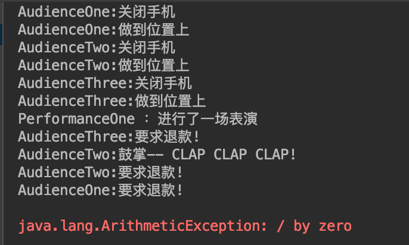
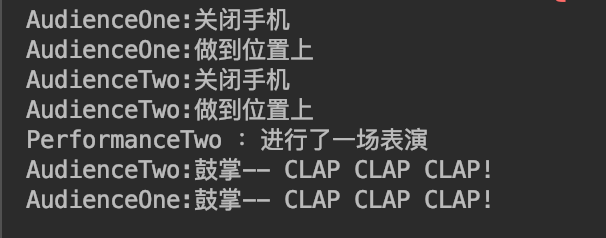
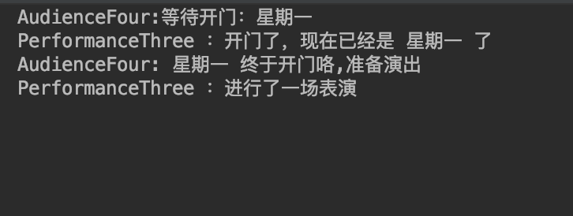

# Spring 学习案例

## Spring AOP

### 文件:[test/java/com/springaction/concert/ConcertTest.java](./src/test/java/com/springaction/concert/ConcertTest.java)

#### 方法:performance1()

- 功能
    - 演示Spring结合AspectJ的表达式来定义切面
    - 综合XML和JavaConfig方式来进行配置
    - 演示异常抛出的情况
- 截图
    
    
    
- 问题
    - 在AudienceThree通过环绕通知拦截目标方法之后，出现了一个意外：
        - AUdienceTwo的After方法，居然执行了，但是实际performance是抛出了异常了的，这个问题还未找到答案
    
#### 方法:performance2()

- 功能
    - 演示Spring结合AspectJ的表达式来定义切面
    - 综合XML和JavaConfig方式来进行配置
    - 演示正常return的情况
- 截图
    
    
    
    
#### 方法:performance3()

- 功能
    - 演示获取方法参数，获取返回结果的切面
- 截图
    
    
- 注意
    - 这个输出结果很有意思，在AudienceFour里，获取返回值(Performance对象)之后，调用了对象的perform方法，但是却没有触发其余的AOP,因为：
        - Spring AOP实际是把目标对象进行了代理，最后Autowired注入的其实是代理对象实例，只有在这个实例上调用方法，才会触发AOP逻辑
        - 本例中，获取到的Return value其实是原本的Performance类型，所以并不会触发其他挂载的AOP切面逻辑