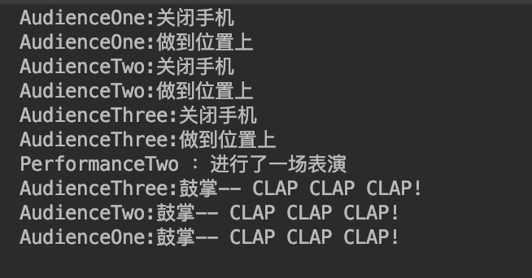

# Spring 学习案例

## Spring AOP

### 文件:[test/java/com/springaction/concert/ConcertTest.java](./src/test/java/com/springaction/concert/ConcertTest.java)

#### 方法:performance1()

- 功能
    - 演示Spring结合AspectJ的表达式来定义切面
    - 综合XML和JavaConfig方式来进行配置
    - 演示异常抛出的情况
- 截图
    
    
    
- 问题
    - 在AudienceThree通过环绕通知拦截目标方法之后，出现了一个意外：
        - AUdienceTwo的After方法，居然执行了，但是实际performance是抛出了异常了的，这个问题还未找到答案
    
#### 方法:performance2()

- 功能
    - 演示Spring结合AspectJ的表达式来定义切面
    - 综合XML和JavaConfig方式来进行配置
    - 演示正常return的情况
- 截图
    
    